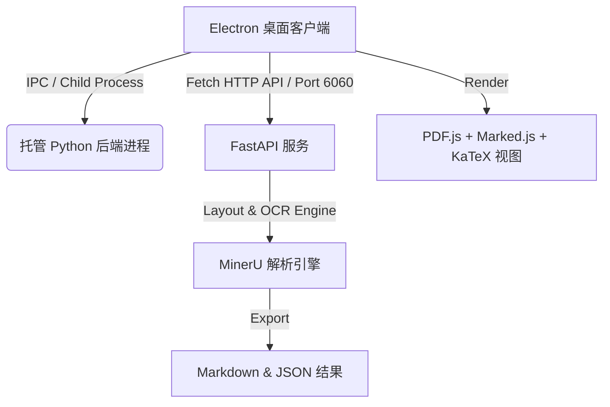

# DocMiner (文档矿工) 🚀

> **DocMiner** 是一款专为大语言模型（LLM）、检索增强生成（RAG）以及 AI Agent 工作流打造的**专业级文档智能解析与挖掘桌面客户端**。它基于强大的 **MinerU** 文档解析引擎，提供高保真的 PDF/图片转 Markdown 及 JSON 功能，并集成了极简、流畅的跨平台桌面操作体验。

---

## ✨ 核心特性

- 📄 **高精度版面分析 (Layout Analysis)**: 智能识别 PDF 与图片中的文字块、表格、图片以及复杂数学公式，完全还原阅读顺序。
- 📊 **双栏对比预览 (Split-Screen Viewer)**: 独创的“原始文档 vs 解析结果 (Markdown/JSON)”对照视图，支持实时同步渲染。
- 🔍 **智能坐标对齐 (Pixel-Perfect BBox)**: 具有可视化边界框（Bounding Box）高亮诊断功能，支持 90°/180°/270° 旋转对齐，精确呈现 AI 对文本、图片、表格及公式的检测划分。
- 🧩 **三种模型策略 (Model Strategies)**:
  - **VLM 模式**: 运用先进的多模态视觉语言模型进行高精度图文和表格结构提取。
  - **Hybrid 模式**: 原生文本提取与视觉检测相结合，兼顾速度与准确度，极低幻觉。
  - **Pipeline 模式**: 纯 CPU/GPU 混合处理流水线，高效解析、稳定性极佳。
- 🛠️ **一键极简启动 (One-Click Start)**: 桌面客户端（Electron）启动时，会自动在后台唤起并托管本地 Python FastAPI 服务（默认端口 `6060`），关闭软件时自动安全销毁，无需任何繁琐命令行操作。
- 🎨 **黑金级视觉美学**: 精心定制的设计系统，包含流畅硬件加速的 SVG 矢量开屏加载动效、暗色侧边栏以及基于 Cormorant Garamond 衬线体的精致字形排版。
- 🖨️ **高精度 PDF 导出与排版引擎 (WYSIWYG PDF Engine)**:
  - **多维预设**: 内置 `标准原版`（原汁原味 100%）、`自适应一页`（字号微缩自适应）、`极简单页`（极简单页适配）以及 `表格微缩` 四大预设方案，锁死 100% 默认物理比例输出。
  - **可视化安全线**: 精准标注 `28.5cm` 红色半透明安全虚线，并配有悬浮于虚线下方的页边距 `安全线` 精致徽章，彻底解决遮挡问题。
  - **高精度自适应**: 自动提取 unscaled 原始 `scrollHeight` 并乘以 `0.965`（3.5% 安全缓冲区）的闭环对齐算法，彻底解决浏览器亚像素舍入、折行和渲染延迟造成的跨页溢出。
  - **像素级打印对齐**: 锁定 `210mm` 物理 A4 容器与 `@media print` 阶段的 `display: block` 纯净文档流，统一 Electron 打印 API 与前端 CSS，彻底告别双重边距带来的排版错位。
  - **全能自定义面板**: 支持正文字号、标题大小、行高、块级间距、表格字号/内衬滑块实时无级微调。且 `比例不变` 与 `自适应单页` 智能互斥且默认勾选 `比例不变`，交互极为流畅。
- 🚀 **云端 CI/CD 自动构建**: 完美接入 GitHub Actions，创建版本标签 (Tag) 即可全自动编译生成 Windows (`.exe`) 和 macOS (`.dmg`) 安装包并发布。

---

## 🏗️ 架构设计

DocMiner 采用轻量级客户端与本地高性能解析服务分离的架构：



- **前端 (Frontend)**: 原生 HTML5, CSS3, ES6 JavaScript, PDF.js, Marked.js (Markdown 渲染), KaTeX (数学公式渲染)。
- **桌面壳 (Desktop Shell)**: Electron, 提供系统原生窗口管理、应用图标支持、自启动 Python 脚本生命周期托管。
- **后端服务 (Backend)**: 基于 Python FastAPI 的微服务，运行在 `127.0.0.1:6060`。

---

## 💻 本地开发与运行指南

### 准备工作
请确保本地已安装以下环境：
- **Node.js** (v18.0.0 或更高版本)
- **Python** (3.10.x 或更高版本)

### 1. 配置 Python 后端环境
1. 在项目根目录下，安装 Python 依赖项：
   ```bash
   pip install -r requirements.txt
   ```
2. （首次运行）初始化 MinerU 模型权重文件，详情请参考 [MinerU 官方模型下载指南](https://opendatalab.github.io/MinerU/usage/model_source/)。

### 2. 运行桌面客户端
1. 在项目根目录下，安装 Electron 客户端所需的依赖：
   ```bash
   npm run desktop-install
   ```
2. 直接运行以下命令启动桌面端：
   ```bash
   npm start
   ```
   *运行该命令后，Electron 将在后台自动启动 `python mineru/cli/fast_api.py --port 6060` 服务，并在加载页检测到服务就绪后自动载入主界面。*

---

## 📦 GitHub Actions 云端打包与发布

本项目已配置完整的 **GitHub Actions 工作流**，可在 GitHub 云端服务器上全自动构建 Windows 和 macOS 客户端。

### 触发自动构建步骤：
1. **推送代码**：将修改本地 commit 并 push 到您 GitHub 的 `DocMiner` 仓库。
2. **打上版本标签**：
   ```bash
   git tag v1.0.0
   ```
3. **推送标签**：
   ```bash
   git push origin v1.0.0
   ```
4. **自动构建与发布**：
   - GitHub Actions 监听到 `v*` 标签的推送后，会自动拉起容器。
   - 分别在 Windows 和 macOS 矩阵下编译前端资源、配置 Electron 依赖，并打包成 `.exe` 与 `.dmg` 文件。
   - 自动在您的仓库中创建一个名为 `v1.0.0` 的 **Release**，并将两个平台的安装包发布到附件中供用户下载。

工作流配置文件位于：[.github/workflows/build-desktop.yml](file:///.github/workflows/build-desktop.yml)。

---

## ⚠️ macOS 运行提示“文件已损坏”或“身份不明的开发者”解决办法

由于打包好的桌面客户端未在 Apple 开发者账号进行官方代码签名（Code Sign），macOS Gatekeeper 安全体系可能会在首次打开应用时拦截，并弹出“软件已损坏，无法打开”或“无法验证开发者”等警告。

### 极速解锁与绕过指令：
请打开您的 Mac 终端（Terminal），直接复制并执行以下命令（以清除 macOS 的隔离 quarantine 标识属性）：
```bash
xattr -cr /Applications/DocMiner.app
```

---

## 🛠️ 技术配置细节

### 默认端口配置
本地解析服务默认运行于 `6060` 端口，可通过修改以下文件进行调整：
- 后端端口：[mineru/cli/fast_api.py](file:///mineru/cli/fast_api.py) (约第 1666 行)
- 前端通信端口：[projects/mineru-web/main.js](file:///projects/mineru-web/main.js) 与 [app.js](file:///projects/mineru-web/app.js)

### 图标与资源
- 应用图标存放于 `projects/mineru-web/assets/logo.png`。
- 编译配置文件配置于 `projects/mineru-web/package.json` 中的 `build` 段落。

---

## 📄 开源协议

本项目基于 MIT 协议开源。
